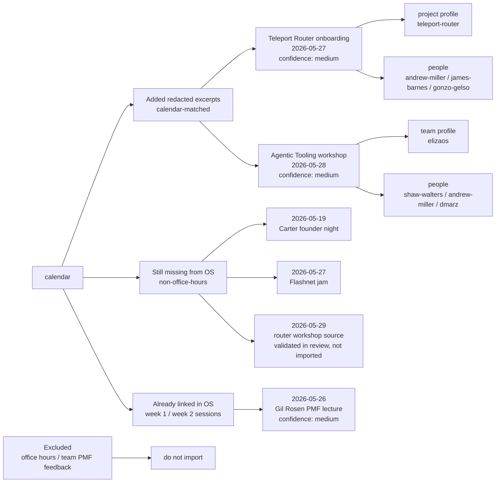

# Reviewed Transcript Import Map

This is the review map for the current Shape Rotator OS transcript audit. It separates existing OS coverage from candidate transcript files that match calendar events but should not be submitted raw until their content boundary is approved.

## Visual Map

## Confidence Scale

| confidence | meaning |
|---|---|
| high | Calendar date/title and transcript file clearly describe the same session. |
| medium | Date and topic line up, but the transcript spans a broader conversation, an adjacent block, or a segment inferred from surrounding context. |
| low | Do not link. The match is too weak for the app surface. |

## Added Redacted Excerpts

These are the only new transcript files added by this pass. They line up with calendar events, but only redacted excerpts are imported because the raw source contains private team feedback or business/customer details.

| transcript | calendar match | confidence | cohort links | useful for | boundary decision |
|---|---|---:|---|---|---|
| [Teleport Router Onboarding Privacy Boundaries May 27 Redacted Transcript](<../apps/os/src/content/context/raw-scripts/Teleport Router Onboarding Privacy Boundaries May 27 Redacted Transcript.txt>) | `2026-05-27` Teleport Router onboarding / Q&A | medium | [Teleport Router](../cohort-data/teams/teleport-router.md), [Andrew Miller](../cohort-data/people/andrew-miller.md), [James Barnes](../cohort-data/people/james-barnes.md), [Gonzo Gelso](../cohort-data/people/gonzo-gelso.md) | Router onboarding, self-intro notebooks, privacy boundaries, Matrix/Router/Hermes workflow. | Added as redacted excerpt only. Raw private PMF/product feedback and customer/business detail are not imported. |
| [Agentic Tooling Workshop May 28 Redacted Transcript](<../apps/os/src/content/context/raw-scripts/Agentic Tooling Workshop May 28 Redacted Transcript.txt>) | `2026-05-28` Agentic Tooling workshops/clinic | medium | [elizaOS](../cohort-data/teams/elizaos.md), [Shaw Walters](../cohort-data/people/shaw-walters.md), [Andrew Miller](../cohort-data/people/andrew-miller.md), [dmarz](../cohort-data/people/dmarz.md) | Agentic interface design, workflow/spell framing, cross-team agent tooling context. | Added as redacted excerpt only. Raw product/investor-style feedback and private event planning are not imported. |

## Requested Set

| calendar block | status | action |
|---|---|---|
| `2026-05-19` Carter Cleveland founder night | unresolved | No importable transcript file found. The only local source hit is a reviewed-notes pointer saying the full raw transcript was not duplicated. |
| `2026-05-26` Gil Rosen PMF lecture | added | Linked to the existing [May 26, wikigen, crossroads](<../apps/os/src/content/context/raw-scripts/May 26, wikigen, crossroads.txt>) transcript. |
| `2026-05-27` Teleport Router onboarding / Q&A | added redacted | Added [Teleport Router Onboarding Privacy Boundaries May 27 Redacted Transcript](<../apps/os/src/content/context/raw-scripts/Teleport Router Onboarding Privacy Boundaries May 27 Redacted Transcript.txt>). |
| `2026-05-27` Flashnet jam | unresolved | No matched transcript file found. |
| `2026-05-28` Agentic Tooling workshops/clinic | added redacted | Added [Agentic Tooling Workshop May 28 Redacted Transcript](<../apps/os/src/content/context/raw-scripts/Agentic Tooling Workshop May 28 Redacted Transcript.txt>). |
| `2026-05-29` router onboarding/workshop | validated in review, not imported | Prior review identified a Router/Hermes context-ingestion transcript as likely matching this calendar block, but the reviewed transcript file is not present in this branch. Do not substitute office-hours material. |

## Calendar Coverage

Office-hours links are intentionally excluded from this PR. This table covers the substantive non-office-hours calendar blocks that currently have an OS transcript or notes match.

| date | calendar block | confidence | linked OS context |
|---|---|---:|---|
| `2026-05-19` | Project intros&workflow | high | [Day 1 Project Intros Notes May 19 2026](<../apps/os/src/content/context/raw-scripts/Day 1 Project Intros Notes May 19 2026.txt>) |
| `2026-05-20` | Tutorial: Dstack | high | [Dstack Intro Salon Session Transcript](<../apps/os/src/content/context/raw-scripts/Dstack Intro Salon Session Transcript_May_20.txt>) |
| `2026-05-20` | Project Intros: Local/Private first | high | [Project Intros Local Private First Phil Transcript](<../apps/os/src/content/context/raw-scripts/Project Intros Local Private First Phil Transcript (2)_May_20.txt>) |
| `2026-05-20` | Phil Daian founder journey | medium | [Project Intros Local Private First Phil Transcript](<../apps/os/src/content/context/raw-scripts/Project Intros Local Private First Phil Transcript (2)_May_20.txt>) |
| `2026-05-21` | Dumb agent tricks | high | [Dumb Agent Tricks Transcript](<../apps/os/src/content/context/raw-scripts/Dumb Agent Tricks Transcript_May_21.txt>) |
| `2026-05-21` | Project Intros: Agentic | high | [Project Intros Agents Day 3](<../apps/os/src/content/context/raw-scripts/Project Intros Agents Day 3 Transcript_May_21.txt>) |
| `2026-05-22` | Project Mappings | high | [Shape Rotator Project Map Guests Transcript](<../apps/os/src/content/context/raw-scripts/Shape Rotator Project Map Guests Transcript_May_22.txt>) |
| `2026-05-22` | PMF Roast | medium | [Friday Shaw & Greg Transcript](<../apps/os/src/content/context/raw-scripts/Friday Shaw & Greg Transcript_May_22.txt>) |
| `2026-05-22` | Founders Journey w/ Shaw | medium | [Friday Shaw & Greg Transcript](<../apps/os/src/content/context/raw-scripts/Friday Shaw & Greg Transcript_May_22.txt>) |
| `2026-05-26` | Project Intros: Elocute, Dealproof, Wikigen, Crossroads | high | [Elocute Transcript May 26](<../apps/os/src/content/context/raw-scripts/Elocute Transcript May 26.txt>), [May 26, wikigen, crossroads](<../apps/os/src/content/context/raw-scripts/May 26, wikigen, crossroads.txt>) |
| `2026-05-26` | Lecture: Defining Product Market Fit, Gil Rosen | medium | [May 26, wikigen, crossroads](<../apps/os/src/content/context/raw-scripts/May 26, wikigen, crossroads.txt>) |
| `2026-05-27` | Teleport Router onboarding / Q&A | medium | [Teleport Router Onboarding Privacy Boundaries May 27 Redacted Transcript](<../apps/os/src/content/context/raw-scripts/Teleport Router Onboarding Privacy Boundaries May 27 Redacted Transcript.txt>) |
| `2026-05-27` | Ideal Customer Profiling / User Interviews | high | [Ideal Customer Profiling / User Interviews](<../apps/os/src/content/context/raw-scripts/Ideal Customer Profiling User Interviews Transcript from Albiona.txt>) |
| `2026-05-28` | Agentic Tooling workshops/clinic | medium | [Agentic Tooling Workshop May 28 Redacted Transcript](<../apps/os/src/content/context/raw-scripts/Agentic Tooling Workshop May 28 Redacted Transcript.txt>) |

## Missing Or Unresolved

These calendar blocks do not currently have an importable OS transcript file. They should not block the reviewed additions above, but they are the remaining audit gaps if the goal is full week 1/2 calendar coverage.

| date | calendar block | OS status | next action |
|---|---|---|---|
| `2026-05-19` | Founder night - Carter Cleveland | Event exists as [Carter Cleveland founder journey](../cohort-data/events/2026-05-19-carter-cleveland-founder-journey.md), but no dedicated transcript is linked in the OS. | Add only if a reviewed recording/transcript exists. |
| `2026-05-27` | Flashnet jam | No matched transcript file found in the OS. | Look for a reviewed jam transcript or leave unlinked. |
| `2026-05-29` | router onboarding/workshop | Prior review found a likely Router/Hermes transcript, but the reviewed transcript file is not present in this branch. | Import only if the reviewed transcript file is recovered; do not substitute office-hours material. |

## Ignored For This Submission

These are intentionally out of scope: office-hours blobs, 1:1 material, private team PMF/GTM/fundraising feedback, private customer/company examples, private event-planning details, and sorting-hat dinner material. This is a confidence-high exclusion: they either do not map to the requested calendar workshop/lecture blocks or require explicit private-boundary approval before becoming OS context.

## What Already Exists

| existing file | calendar/event role | useful for |
|---|---|---|
| [Project Intros Local Private First Phil Transcript](<../apps/os/src/content/context/raw-scripts/Project Intros Local Private First Phil Transcript (2)_May_20.txt>) | `2026-05-20` Local/Private project intros | Existing intro context for Pramaana, TinyCloud, Bitrouter, TeeSQL, SignalStack. |
| [Project Intros Agents Day 3](<../apps/os/src/content/context/raw-scripts/Project Intros Agents Day 3 Transcript_May_21.txt>) | `2026-05-21` Agentic project intros | Existing intro context for Contexto, Conclave, Router, JJHub. |
| [Elocute Transcript May 26](<../apps/os/src/content/context/raw-scripts/Elocute Transcript May 26.txt>) | `2026-05-26` project intros | Existing public project-intro context for Elocute/Albi. |
| [Ideal Customer Profiling / User Interviews](<../apps/os/src/content/context/raw-scripts/Ideal Customer Profiling User Interviews Transcript from Albiona.txt>) | `2026-05-27` ICP / user interviews | Existing workshop context with Albiona/Albi in the calendar surface. |

## Redaction Rule

Do not submit raw transcript files whose main content is private PMF, GTM, fundraising, positioning, customer/company, or product feedback to a specific team unless that team/person explicitly approves the boundary. When in doubt, add only a redacted excerpt that preserves the calendar/session context, link to existing team/person profile Markdown, and hold the raw transcript.
